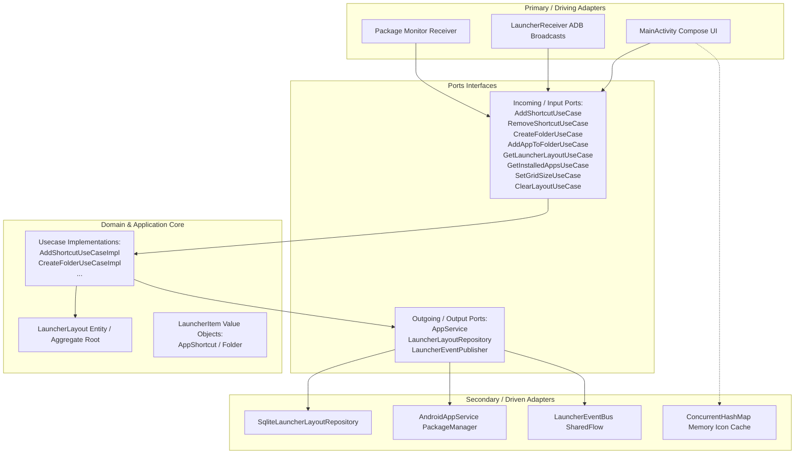

# AGY Program Launcher (DDD & Hexagonal Architecture)

A custom, modern Android launcher written in **Kotlin** using **Jetpack Compose** that is designed for **programmatic control**. 

Unlike standard Android launchers (which encrypt/protect their workspace layouts), this launcher exposes incoming adapter interfaces so that an external agent (or developer) can fully query, modify, add, remove, and manage desktop items using standard ADB shell commands.

---

## 🏗️ Hexagonal Architecture (Ports and Adapters) & DDD

The codebase is organized according to Domain-Driven Design (DDD) principles and Hexagonal Architecture:



* **Domain Core (`domain/model`)**: Plain Kotlin files housing entities (`LauncherLayout`, `LauncherItem`) and core rules (e.g. grid positioning limits, overlap checks). Contains no Android framework code.
* **Ports (`domain/port`)**: Clean interfaces describing entry and exit portals of the application core.
* **Application Core (`application/usecase`)**: Coordinates business logic actions, driving state changes in domain entities and saving outputs to secondary ports.
* **Adapters (`adapter`)**: Android infrastructure plugins:
  * **Primary (Driving)**: Jetpack Compose rendering the layout grid, `LauncherReceiver` interpreting ADB system messages, and dynamic `Package Monitor` tracking installs.
  * **Secondary (Driven)**: SQLite storing coordinates (with folders items serialized as JSON arrays inside the package name field), `AndroidAppService` querying packages, and `LauncherEventBus` notifying updates.

---

## ⚡ Performance Profiling & Typography

* **Premium Typography**: Structured around custom font spacing (`letterSpacing` rules of `-0.5.sp` for headers and `-2.sp` for the custom home screen Clock Widget) to deliver a modern, high-end visual aesthetic.
* **Real-time Profiling**: Measures DB queries with microsecond precision (`System.nanoTime()`), displaying layout loading performance directly in the UI header (`⚡ DB: X.XX ms`).
* **Scrolling Optimization**: List icons are queried asynchronously in a coroutine background thread pool (`Dispatchers.IO`) and cached in an in-memory `ConcurrentHashMap` cache. Scrolling through 150+ apps runs at a buttery-smooth 60/120 FPS.

---

## 🤖 Programmatic Control via ADB (Agent commands)

Android 8.0+ restricts implicit background broadcasts. When triggering actions, you **MUST** target the application package explicitly with the `-p com.example.programlauncher` flag:

### 1. Add a Shortcut to the Home Screen
```bash
adb shell am broadcast \
  -p com.example.programlauncher \
  -a com.example.programlauncher.ADD_SHORTCUT \
  --es package "com.android.chrome" \
  --ei x 0 \
  --ei y 0 \
  --ei screen 0
```

### 2. Create a Folder on the Desktop Grid
```bash
adb shell am broadcast \
  -p com.example.programlauncher \
  -a com.example.programlauncher.CREATE_FOLDER \
  --es label "Social" \
  --ei x 1 \
  --ei y 0
```

### 3. Add an Application to a Folder
```bash
adb shell am broadcast \
  -p com.example.programlauncher \
  -a com.example.programlauncher.ADD_TO_FOLDER \
  --es folder "Social" \
  --es package "org.telegram.messenger"
```

### 4. Remove a Shortcut or Folder
* **By Package Name**:
  ```bash
  adb shell am broadcast \
    -p com.example.programlauncher \
    -a com.example.programlauncher.REMOVE_SHORTCUT \
    --es package "com.android.chrome"
  ```
* **By Grid Coordinate** (Deletes either folder or shortcut at coordinates):
  ```bash
  adb shell am broadcast \
    -p com.example.programlauncher \
    -a com.example.programlauncher.REMOVE_SHORTCUT \
    --ei x 0 \
    --ei y 0
  ```

### 5. Change Desktop Grid Dimensions
```bash
adb shell am broadcast \
  -p com.example.programlauncher \
  -a com.example.programlauncher.SET_GRID \
  --ei cols 5 \
  --ei rows 6
```

### 6. Clear/Wipe Entire Workspace Layout
```bash
adb shell am broadcast \
  -p com.example.programlauncher \
  -a com.example.programlauncher.CLEAR_LAYOUT
```

---

## 🛠️ Project Compilation & Installation

### Build Debug APK
```bash
./gradlew assembleDebug
adb install -r app/build/outputs/apk/debug/app-debug.apk
```

### Build Optimized Release APK
The project is pre-configured to bind the standard signing keystore automatically to the release build.
```bash
./gradlew assembleRelease
adb install -r app/build/outputs/apk/release/app-release.apk
```

Set **Program Launcher** as your default home application in Android Settings (`Settings` -> `Apps` -> `Default Apps` -> `Home app`).
