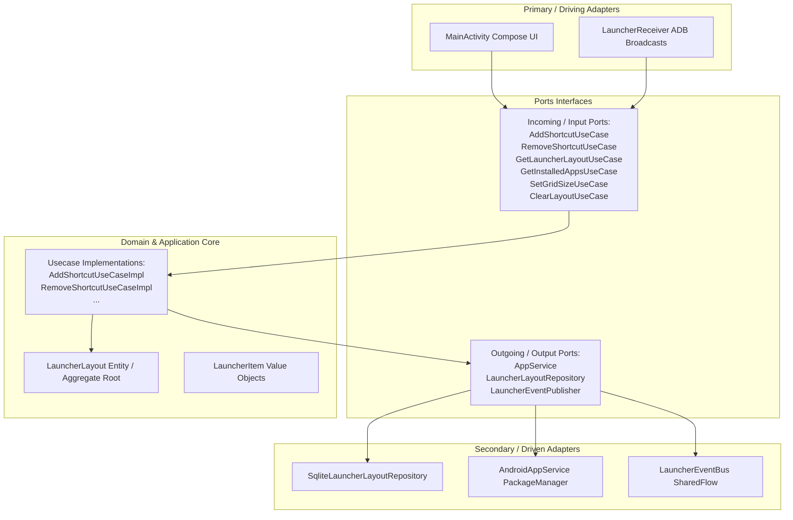

# AGY Program Launcher (DDD & Hexagonal Architecture)

A custom, modern Android launcher written in **Kotlin** using **Jetpack Compose** that is designed for **programmatic control**. 

Unlike standard Android launchers (which encrypt/protect their workspace layouts), this launcher exposes incoming adapter interfaces so that an external agent (or developer) can fully query, modify, add, remove, and manage desktop items using standard ADB shell commands.

---

## 🏗️ Hexagonal Architecture (Ports and Adapters) & DDD

The codebase is organized according to Domain-Driven Design (DDD) principles and Hexagonal Architecture:



* **Domain Core (`domain/model`)**: Plain Kotlin files housing entities (`LauncherLayout`, `LauncherItem`) and core rules (e.g. grid positioning limits, overlap checks). Contains no Android framework code.
* **Ports (`domain/port`)**: Clean interfaces describing entry and exit portals of the application core.
* **Application Core (`application/usecase`)**: Coordinate business logic actions, driving state changes in domain entities and saving outputs to secondary ports.
* **Adapters (`adapter`)**: Android infrastructure plugins:
  * **Primary (Driving)**: Jetpack Compose rendering the layout grid and `LauncherReceiver` interpreting ADB system messages.
  * **Secondary (Driven)**: SQLite storing coordinates and package listings mapping launcher components.

---

## 🤖 Programmatic Control via ADB (Agent commands)

Once compiled and installed on the target Android device, you can control the launcher desktop programmatically. The ADB commands translate directly to the system adapter:

### 1. Add a Shortcut to the Home Screen
```bash
adb shell am broadcast \
  -a com.example.programlauncher.ADD_SHORTCUT \
  --es package "com.android.chrome" \
  --ei x 0 \
  --ei y 0 \
  --ei screen 0
```
* **package**: Application package name to add.
* **x**: Horizontal coordinate (0 to column count - 1).
* **y**: Vertical coordinate (0 to row count - 1).
* **screen**: Workspace page index (defaults to `0`).

### 2. Remove a Shortcut
* **By Package Name** (removes all matching instances):
  ```bash
  adb shell am broadcast \
    -a com.example.programlauncher.REMOVE_SHORTCUT \
    --es package "com.android.chrome"
  ```
* **By Grid Coordinate**:
  ```bash
  adb shell am broadcast \
    -a com.example.programlauncher.REMOVE_SHORTCUT \
    --ei x 0 \
    --ei y 0 \
    --ei screen 0
  ```

### 3. Change Desktop Grid Layout Size
```bash
adb shell am broadcast \
  -a com.example.programlauncher.SET_GRID \
  --ei cols 5 \
  --ei rows 6
```

### 4. Clear/Wipe Entire Home Screen
```bash
adb shell am broadcast -a com.example.programlauncher.CLEAR_LAYOUT
```

---

## 🛠️ Project Setup & Installation

1. Import this project into **Android Studio** (Hedgehog or newer recommended).
2. Set Gradle JVM version to Java 17+.
3. Compile and run the `app` module on your phone or emulator.
4. Set **Program Launcher** as your default home application in Android Settings (`Settings` -> `Apps` -> `Default Apps` -> `Home app`).
